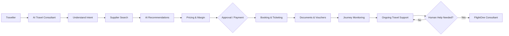
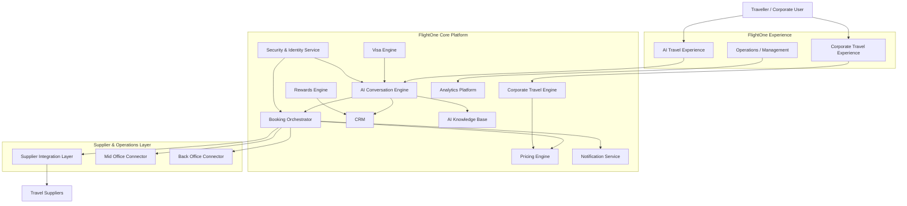
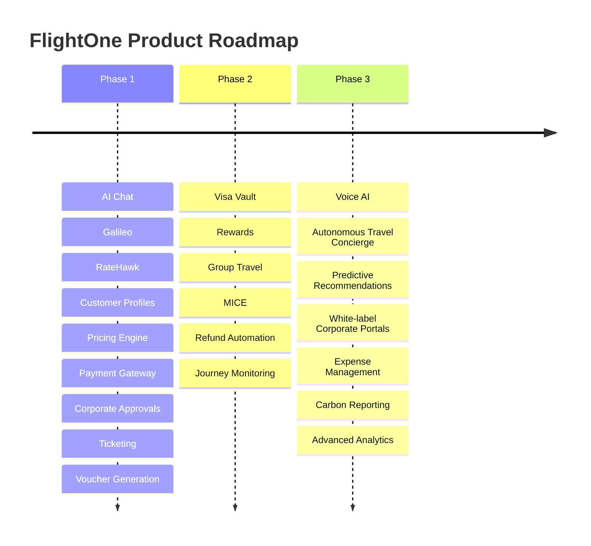

# FlightOne

## AI Travel Operating System

> **FlightOne** is an AI-first Travel Operating System designed to transform traditional travel management into an intelligent, conversational, end-to-end travel experience.

[](#)
[](#)
[](#)
[](#)

---

## ✦ What is FlightOne?

FlightOne is being built as an **AI-powered Travel Operating System (AI-TOS)** that enables travellers and businesses to manage travel through natural conversation rather than fragmented booking workflows.

The platform is designed to understand traveller intent, search suppliers, curate relevant options, apply pricing and travel policies, manage approvals or payments, issue travel documents, and continue supporting the traveller throughout the journey.

### Product Vision

> **Make AI the primary travel consultant while keeping human expertise available whenever it adds value.**

The long-term product vision combines:

- Human-like travel consultation
- Enterprise travel management
- AI booking automation
- Live travel assistance
- Corporate travel controls
- Group travel collaboration
- MICE management

---

## ✦ Core Principles

| Principle | Meaning |
|---|---|
| **Think before searching** | Understand the traveller's intent before querying suppliers. |
| **Recommend instead of listing** | Curate relevant options instead of overwhelming users. |
| **Learn continuously** | Improve recommendations through traveller interactions and preferences. |
| **Remember preferences** | Maintain useful traveller context across journeys. |
| **Escalate intelligently** | Involve human consultants when human intervention adds value. |
| **Automate where possible** | Reduce repetitive travel servicing work. |
| **Keep humans in control** | Preserve human oversight for sensitive or complex situations. |

---

# ✦ Product Experience



---

# ✦ Platform Capabilities

| Capability | Description |
|---|---|
| 🤖 **AI Travel Consultant** | Conversational travel planning and servicing built around natural-language traveller intent. |
| ✈️ **Travel Search & Booking** | Search and booking workflows for flights and hotels through supplier integrations. |
| 🧠 **Intelligent Recommendations** | Curates relevant options instead of exposing users to raw supplier inventories. |
| 💰 **Pricing & Margin Engine** | Supports supplier net fares, dynamic markups, discounts and corporate pricing. |
| 🏢 **Corporate Travel** | Companies, departments, cost centres, policies, approvals and billing. |
| 🔐 **Traveller Vault** | Secure traveller documents and travel information. |
| 🛂 **Visa Intelligence** | Centralized visa-related intelligence and traveller support. |
| 🎁 **Rewards** | Rewards, credits, referrals and loyalty programmes. |
| 👥 **Group Travel** | Collaborative group travel management. |
| 🎪 **MICE** | Meetings, Incentives, Conferences and Exhibitions management. |
| 🧑‍💼 **Human Agent Escalation** | AI-to-human service handoff for complex journeys. |
| 🔄 **Refund & Reissue** | Post-booking servicing workflows. |
| 📊 **Management Dashboard** | Business and operational analytics. |

---

# ✦ Product Modules

| # | Module | Purpose |
|---:|---|---|
| 01 | **AI Travel Consultant** | Conversational travel planning and servicing |
| 02 | **Booking Engine** | Travel reservation and booking workflows |
| 03 | **Supplier Integration Layer** | Connect travel inventory providers |
| 04 | **Intelligent Recommendation Engine** | Curate relevant travel options |
| 05 | **Pricing & Margin Engine** | Pricing, markup and profitability controls |
| 06 | **Corporate Travel** | Enterprise travel policies and workflows |
| 07 | **Traveller Vault** | Secure traveller documents and information |
| 08 | **Visa Intelligence** | Visa information and assistance |
| 09 | **Payments** | Travel payment and approval workflows |
| 10 | **Rewards & Loyalty** | Rewards, credits and loyalty programmes |
| 11 | **Group Travel** | Collaborative group travel management |
| 12 | **MICE Platform** | Event and business travel management |
| 13 | **Human Agent Escalation** | AI-to-human service handoff |
| 14 | **Refund & Reissue Engine** | Post-booking servicing |
| 15 | **Journey Monitoring** | Ongoing journey assistance |
| 16 | **AI Knowledge Base** | Travel and operational knowledge |
| 17 | **Management Dashboard** | Business and operational analytics |

---

# ✦ System Architecture



---

# ✦ Supplier Integrations

## Phase 1

| Category | Integration |
|---|---|
| ✈️ Flights | **Galileo GDS** |
| 🏨 Hotels | **RateHawk API** |

## Future Integrations

- Amadeus
- Sabre
- NDC
- Airline Direct APIs
- Hotelbeds
- WebBeds
- Expedia Partner Solutions
- Viator
- Insurance providers
- Airport transfer providers

> Future integrations are roadmap items and should not be interpreted as currently deployed integrations.

---

# ✦ Recommendation Engine

FlightOne is designed to evaluate:

```text
Price
  ↓
Journey Duration
  ↓
Layovers
  ↓
Airline Quality
  ↓
Arrival Times
  ↓
Traveller Preferences
  ↓
Loyalty Benefits
  ↓
Refundability
  ↓
Supplier Reliability
  ↓
Curated Recommendations
```

The PRD specifies that customers should typically receive **three curated recommendations**.

---

# ✦ Corporate Travel

FlightOne is designed to support:

- Multiple companies
- Departments
- Cost centres
- Travel policies
- Approval workflows
- Credit limits
- Billing cycles
- Corporate invoicing
- Budget enforcement
- Project codes

Corporate travellers can switch between **Corporate** and **Personal** profiles while maintaining separate payment methods and booking histories.

---

# ✦ Group Travel


Supported use cases include:

- Corporate tours
- Student groups
- Umrah & Hajj
- Leisure tours
- Sports teams
- Family travel

---

# ✦ MICE Platform

The MICE platform is intended to support:

- Delegate registration
- Flights
- Hotels
- Transfers
- Event agendas
- QR check-in
- Badge generation
- Attendance tracking
- Budget management
- Sponsor management
- Event reporting

---

# ✦ Human Escalation

FlightOne is designed to transfer customers to human consultants when appropriate:

- Customer-requested assistance
- VIP bookings
- Complex itineraries
- Supplier failures
- Refund disputes
- Medical assistance
- Special service requests

The intended experience preserves the relevant AI conversation history during escalation.

---

# ✦ Development Roadmap



---

# ✦ Product Objectives

The PRD defines these core objectives:

- Reduce booking time from **20 minutes to under 3 minutes**
- Automate repetitive travel servicing
- Increase booking conversion rates
- Improve customer satisfaction
- Reduce operational workload
- Create a scalable technology platform for future expansion

> These are **product objectives**, not claims of current production performance.

---

# ✦ Security

FlightOne's architecture includes a dedicated **Security & Identity Service** and is designed around controlled access to sensitive travel information.

Security considerations include:

- Authentication and authorization
- Protected traveller information
- Controlled staff access
- Secure supplier integrations
- Secure payment integrations
- Secret management
- Separation of operational responsibilities

> No security certification, compliance certification, or production security guarantee is claimed here unless separately documented.

---

# ✦ Technology

The technology section should reflect the **verified implementation state of the repository**, rather than assuming that technologies mentioned in the product vision are already deployed.

---

# ✦ Repository Structure

```text
FlightOne/
├── client/
├── server/
├── docs/
└── README.md
```

> The exact internal structure may evolve as FlightOne progresses through development.

---

# ✦ Engineering Principles

```text
┌─────────────────────────────────────────────┐
│              FLIGHTONE ENGINEERING          │
├─────────────────────────────────────────────┤
│  Evidence over assumptions                  │
│  Real supplier data over fabricated data    │
│  Modular architecture                       │
│  Small, controlled changes                  │
│  Regression testing                         │
│  End-to-end verification                    │
│  Security-first secret handling             │
│  Human oversight where required             │
└─────────────────────────────────────────────┘
```

---

# ✦ Current Product Direction

FlightOne is being developed toward an **AI-first travel operating model** where conversational AI becomes the primary interface for travel planning and servicing.

The platform is intended to progressively connect:

**Traveller → AI → Travel Suppliers → Pricing → Booking → Operations → Journey Support**

while preserving the ability to bring human travel consultants into the workflow whenever their expertise is required.

---

## FlightOne

### AI Travel Operating System

**Think less. Search less. Travel smarter.**

> **Project:** FlightOne  
> **Product:** AI Travel Operating System (AI-TOS)  
> **Documentation basis:** FlightOne Product Requirements Document
