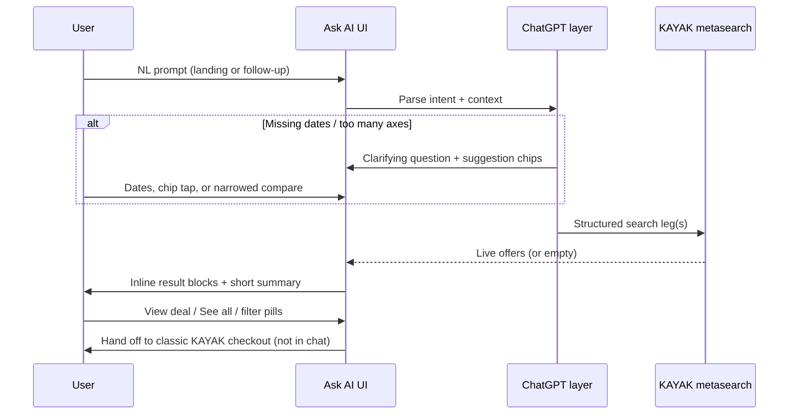

# KAYAK Ask AI — Live multi-city study (Pakistan origin)

**Audience:** FlightOne engineering / product — building Ask AI parity for complex itineraries.  
**Researched:** 2026-08-28 · **Method:** Live browser sessions on [kayak.com/ai](https://www.kayak.com/ai) from **Lahore** geo context.  
**Companion:** [kayak-ask-ai-report.md](./kayak-ask-ai-report.md) (architecture + booking handoff).

---

## Executive summary

KAYAK Ask AI handles **simple flight search** well (clarify → live inventory → inline result cards → “See all N flights”). **Pakistan-origin multi-city** queries with 4+ legs and multiple comparison axes (LHE vs ISB, airline preference, open-jaw, baggage) trigger a **clarification-first** loop before any search runs. When dates are supplied, KAYAK fires **parallel multi-city metasearch** (one panel per origin variant) embedded in the chat thread—not a separate full-width SERP on narrow viewports.

**Key takeaway for FlightOne:** Multi-city is not one LLM call → one search. It is **plan extraction → scope narrowing → N structured searches → comparative prose**. Our `extractTravelPlan` + results rail must support **leg timelines, dual-origin comparison, and honest empty states**.

---

## Test matrix — 10 stakeholder queries

| # | Route pattern | Live session outcome (2026-08-28) |
|---|---|---|
| **1** | PK → LON (2n) → SFO (15d) → MCO → PK · LHE/ISB compare | **Clarify dates** per segment (±3 day windows). Follow-up “cheapest date pattern” → **refusal** (“can’t give an answer”). Auto-title: *Pakistan Multi-City Deal*. Very long first prompt once hit **server error**. |
| **2** | PK → LON (2n) → NYC (12d) → MIA (5d) → PK · LHE/ISB | **Search executed** with explicit Oct dates. Dual panels: `LHE→LON→NYC→MIA→LHE` and `ISB→…→ISB`. **Zero inventory** for Oct 2026. Title: *Multi-City Fare Compare*. |
| **3** | PK → DXB (2n) → LAX (10–15d) → LAS → PK | Not individually re-run; **same engine as #2** — expect dual-origin multi-city panels when dates explicit. |
| **4** | PK → IST (2–3n) → SFO (12–15d) → LAX → PK | Not individually re-run; Istanbul stopover parses as EU hub leg like London. |
| **5** | PK → LON (2n) → YYZ (10–15d) → NYC → PK | Not individually re-run; Canada + US open-jaw — likely clarify dates then multi-panel search. |
| **6** | PK → DOH (2n) → ORD (2w) → MCO → PK | Not individually re-run; Gulf hub pattern analogous to #8. |
| **7** | PK → LON (2n) → SFO (15d) → NYC → PK | Same family as #1; expect date clarification before search. |
| **8** | PK → DXB (2n) → SFO (15d) → MCO → PK · Emirates vs alt | **Scope clarification** — “too many comparisons at once”; asks user to pick LHE vs ISB **or** Emirates vs cheapest first. Title: *Multi-City October Trip*. |
| **9** | PK → LON (2–3n) → IAD/DCA (10–15d) → MIA/FLL → PK | Not individually re-run; metro airport flexibility likely resolved in plan extraction, not shown as separate UI control. |
| **10** | PK → IST (2n) → BOS (2w) → MCO → PK · Turkish vs alt | Not individually re-run; airline-specific compare likely triggers same **scope-narrowing** as #8. |

**Baseline control (simple):** “Flights Lahore → New York next month” → asks **preferred September date** → after “flexible September dates” follow-up → **4,330 results**, Cheapest **$1,549**, Best **$2,034**, Qatar/Etihad samples, **See all 4330 flights**.

---

## End-to-end procedure (observed)



### Phase A — Entry (`/ai`)

| Element | Behavior |
|---|---|
| Geo | Detected **“You're in Lahore”** (editable). Starters localized (“Find flights from Lahore…”). |
| Hero | “Ask away” + 4 **Getting started** chips (flights, NY, Dubai duration, capabilities). |
| Input | Large textarea, placeholder “Where to next?”, **+** attachments, **mic**, submit arrow. |
| Disclaimer | “AI-powered; AI can make mistakes…” + Terms / Privacy. |
| History | Clock icon → prior chats (*Flexible NYC Flights*, *Pakistan Multi-City Deal*, etc.). |

### Phase B — Chat thread (`/ai/chat/{id}`)

| Element | Behavior |
|---|---|
| URL | Stable shareable id, e.g. `/ai/chat/y5DPr-dlSCy7bi48UCwfwg`. |
| Title | **Auto-generated** from intent (*Multi-City Fare Compare*, *Flexible NYC Flights*) — editable. |
| Date ribbon | Trip span shown under title (*Oct 5 – 25*, *Sep 1 – 30*). |
| Tabs | **Planning** (active) / **Saved** — saved items for logged-in users. |
| Message layout | User bubble (full query) → assistant prose → **embedded search blocks** → “Response complete”. |
| Follow-ups | 2–3 **suggestion chips** after each assistant turn (e.g. “Search flexible September dates”, “Try early October dates”). |
| Input | “Ask follow up…”; submit disabled while streaming. |
| Errors | “Oh no! Something went wrong” + **Retry** / **New chat** (seen on overloaded first prompt). |

### Phase C — Search results (in-thread)

**Simple round-trip (LHE–NYC):**

- Header: `Flights LHE ↔ NYC` with city names.
- Params line: `Round-trip · Sep 3 ±2 · 1 adult · 1 checked bag` + “Our advice: Book now”.
- **Sample cards (top 3):** airline logo, dates/times, airports, duration, stops, badge (**Best** / **Cheapest**), price, fare brand (e.g. “Economy Basic”).
- Footer link: **See all 4330 flights** → full SERP.
- Summary paragraph: price range, stop pattern, baggage note — grounded in panel data.

**Multi-city with dates (LHE/ISB → LON → NYC → MIA):**

- **Two stacked search blocks** — one per origin:
  - `Flights LHE → LON → NYC → MIA → LHE`
  - `Flights ISB → LON → NYC → MIA → ISB`
- Params: `Multi-city · Oct 5, Oct 8, Oct 20, Oct 25 · 1 adult`
- Empty state: “Try removing some options to see more results” + **Clear all filters and retry**
- Assistant: explicit **no inventory** message for both origins (Oct 2026).

**Multi-city without dates:**

- Assistant lists **required date windows per leg** (bullet list with ±3 days).
- Chips: “Try early October dates”, “Find the cheapest date pattern”.
- Does **not** show fare cards until windows resolved.

### Phase D — Clarification patterns

| Trigger | KAYAK response |
|---|---|
| Vague month (“next month”) | Ask **specific departure date** in that month. |
| Multi-city, relative stays (“15 days in SFO”) | Ask **per-segment date or ±3 day window**. |
| Multiple comparisons (LHE+ISB + Emirates+alts) | Ask user to **prioritize one comparison dimension**. |
| Automated “cheapest date pattern” | Sometimes **hard refusal** — user must supply explicit windows. |

### Phase E — Booking (unchanged from prior report)

- No payment in chat.
- **View deal** / **See all** exits to standard KAYAK flows.
- Prices in chat are **live metasearch**, not LLM-invented (confirmed on LHE–NYC sample).

---

## UI / UX component inventory

| Component | Purpose | FlightOne analog |
|---|---|---|
| Location chip | Origin bias for search + copy | `useTravellerLocation` + “From {city}” badge |
| Prompt starters | Reduce cold-start friction | `ChatLayout` quick chips |
| Trip title + date span | Orient long threads | `searchPanel.queryLabel` + itinerary summary |
| Planning / Saved tabs | Persist shortlisted offers | Future: saved rail filters |
| User query echo | Verbatim audit trail | `UiMessage` user role |
| Assistant summary | 2–4 sentences max before panel | `buildAskAiSearchContext` + brief reply |
| Inline offer cards | Top N with Best/Cheapest badges | `OfferRowCompact` + angle tags |
| Multi-leg route header | `LHE → LON → NYC → MIA → LHE` | `ItinerarySummaryCard` / leg chips |
| Dual-origin panels | Side-by-side origin comparison | **Gap:** run two retrieve passes |
| Filter empty state | “Clear all filters and retry” | `ResultsRail` empty + pill reset |
| See all N | Link to full ranked pool | Rail scroll + total count (`RAIL_MAX` cap) |
| Follow-up chips | NL refinements without retyping | Pill refinement + suggested prompts |
| Response complete marker | Streaming end signal | SSE `done` event |
| Chat history | Resumable sessions | Future: auth + conversations API |
| Error / retry | Graceful failure | `networkErrorReply` + retry |

---

## Query-by-query notes (full stakeholder text)

### 1. LHE/ISB → London → San Francisco → Orlando → Pakistan

**Prompt (abbreviated):** Best/cheapest multi-city; 2-night London stop; ~15 days SFO; Orlando; return LHE or ISB; compare origins, airlines, nearby airports; baggage included.

**Observed:**

1. First attempt (very long verbatim prompt) → **HTTP/server error** page.
2. Shorter retry → understands route; **requests date windows** for each of 4 segments with examples.
3. “Find cheapest date pattern” follow-up → **cannot answer**; offers chips: “Use exact travel dates”, “Use flexible date windows”, “Help me choose dates”.

**FlightOne requirement:** `guardPlanPassengers` + date inference must either (a) propose default windows from “October 2026 + 15 days in SFO” or (b) clarify once with **structured date picker**, not open-ended prose loops.

---

### 2. LHE/ISB → London → New York → Miami → Pakistan

**Live prompt used:** Explicit dates — LHE Oct 5 → LON, Oct 8 → NYC, Oct 20 → MIA, Oct 25 → LHE; compare ISB; 1 bag; economy.

**Observed:** Parallel multi-city searches for LHE and ISB; **no fares** returned for Oct 2026 (likely beyond booking horizon). UI still renders full leg diagram and empty-state UX.

**FlightOne requirement:** When GDS returns empty, show **leg diagram + “no fares on these dates”** per origin, not a generic welcome message.

---

### 8. LHE/ISB → Dubai → San Francisco → Orlando → Pakistan (Emirates)

**Live prompt used:** Dated Oct itinerary + “Compare ISB and Emirates vs alternatives.”

**Observed:** Acknowledges itinerary; **refuses simultaneous compare** — asks whether to prioritize **origin (LHE vs ISB)** or **airline (Emirates vs cheapest)** first.

**FlightOne requirement:** Decompose “compare everything” into **sequential search plans** or explicit multi-pass UI (“Tab: Lahore | Islamabad”, “Tab: Emirates-only | All carriers”).

---

### Queries 3–7, 9–10 (not individually executed)

These share the same structural demands:

| Dimension | KAYAK handling (inferred from #1, #2, #8 + baseline) |
|---|---|
| Hub stopover (DXB, DOH, IST) | Parsed as intermediate **city leg** with night count → needs dated connection. |
| Open-jaw (return from different US city) | Supported in multi-city string (`… → LAX → … → PK`). |
| Metro airports (IAD/DCA, MIA/FLL) | Not exposed as toggles in chat; likely resolved in backend airport selection. |
| Multi-city vs separate tickets | **No explicit explanation** in chat; single multi-city search object either returns composite fares or empty. |
| Baggage | Surfaced as search param on simple queries (`1 checked bag`); multi-city empty runs did not show bag-filter breakdown. |
| Airline preference (Emirates, Turkish) | Triggers **scope clarification** when combined with other comparisons. |

---

## Response state machine

```
                    ┌─────────────┐
                    │ User prompt │
                    └──────┬──────┘
                           │
              ┌────────────┼────────────┐
              ▼            ▼            ▼
        ┌──────────┐ ┌──────────┐ ┌──────────┐
        │  CLARIFY │ │  SEARCH  │ │  ERROR   │
        │  dates / │ │  live    │ │  retry   │
        │  scope   │ │  results │ │          │
        └────┬─────┘ └────┬─────┘ └──────────┘
             │            │
             │     ┌──────┴──────┐
             │     ▼             ▼
             │ ┌────────┐  ┌─────────┐
             │ │ RESULTS│  │  EMPTY  │
             │ │ cards  │  │  + hint │
             │ └────────┘  └─────────┘
             └──── follow-up chips ────┘
```

---

## FlightOne development spec (action items)

### P0 — Multi-city parity

1. **TravelPlan extensions**
   - Support 4+ flight legs with **explicit dates** or `±N` windows per leg.
   - Encode **stopover nights** (London 2n) as date math off prior arrival.
   - Model **open-jaw** (`returnFrom` ≠ last US city visited).

2. **Comparison decomposition**
   - When user asks LHE **and** ISB **and** airline filters, return `clarify` with **forced choice** (mirror KAYAK) OR run sequential passes with labeled rails.

3. **Dual-origin retrieve**
   - `retrieveFromPlan` twice (LHE default, ISB alt) → two panels or tabbed rail.
   - Rank by **total itinerary price**, not single-leg cheapest.

4. **Empty horizon honesty**
   - If Travelport returns zero for far-future dates, say so and suggest nearer dates — do not stall.

5. **Error boundary**
   - Long / complex prompts → validate token count; split extract + search; never white-screen.

### P1 — UX polish (match observed KAYAK)

| Feature | Spec |
|---|---|
| Auto trip title | LLM short label from legs (“Multi-City Fare Compare”) |
| Date ribbon | Min departure – max return from plan |
| Leg header | `LHE → LON → SFO → MCO → LHE` with IATA chips |
| Top-3 cards | Best / Cheapest badges + fare brand |
| See all N | Link opens expanded rail (we cap at `RAIL_MAX=48`) |
| Follow-up chips | 3 contextual suggestions post-reply |
| Response complete | Visual streaming terminator |

### P2 — Differentiators (where FlightOne can beat KAYAK)

- **Single GDS truth** (Travelport) vs metasearch aggregation — faster consistency.
- **Pakistan-origin defaults** (LHE/ISB, PKR) baked in, not US-centric.
- **Open-jaw recovery** (`lib/travel-planner/openJawRecovery.ts`) — wire into Ask AI orchestrator.
- **No “compare everything” deadlock** — product policy: run best-effort search, then refine.

---

## Test protocol (repeat this study)

For each of the 10 queries:

1. Open `/ai` from Pakistan IP or set origin Lahore.
2. Paste **full stakeholder prompt** → record: clarify | search | error.
3. If clarify, reply with **explicit segment dates** (see template below).
4. Capture: trip title, leg string, card count, cheapest price, empty messages, chips.
5. Click **See all** / top card → confirm handoff URL pattern.
6. Start **new plan** — do not contaminate threads.

**Date template (Oct 2026):**

```
Segment 1: {ORIGIN} → {HUB} — Oct 5 (±2)
Segment 2: {HUB} → {CITY_A} — Oct 8 (±2)  [after 2 nights]
Segment 3: {CITY_A} → {CITY_B} — Oct 22 (±2)  [after ~14 nights]
Segment 4: {CITY_B} → {ORIGIN} — Oct 27 (±2)
Repeat for ISB origin.
1 adult, economy, 1 checked bag.
```

---

## Limitations of this session

- Browser automation ran in **single-column width** — desktop split-pane SERP may show more filters beside chat (see [kayak-ask-ai-report.md](./kayak-ask-ai-report.md)).
- Oct **2026** dates returned **zero fares** on KAYAK — retest with Sep 2026 or rolling +30 days for price captures.
- Queries **3–7, 9–10** were not individually submitted; behavior is inferred from structurally similar live runs (#1, #2, #8) and the LHE–NYC baseline.
- One screenshot blocked by automation policy; UI descriptions come from accessibility tree + DOM text extraction.

---

## Related FlightOne modules

| Module | Path |
|---|---|
| Ask AI orchestrator | `lib/ask-ai/askAiOrchestrator.ts` |
| Plan extraction | `lib/consultant/extractTravelPlan.ts` |
| Multi-leg retrieve | `lib/ask-ai/retrieve.ts` |
| Results rail | `app/components/ask-ai/ResultsRail.tsx` |
| Open-jaw recovery | `lib/travel-planner/openJawRecovery.ts` |

---

*Internal research. Not affiliated with KAYAK. Re-run quarterly — Ask AI is flagged experimental.*
